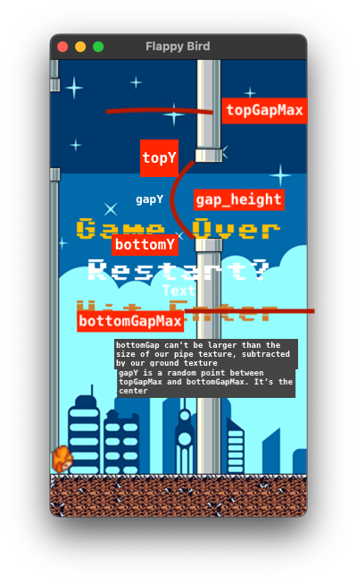

## Flappy Bird on SDL2

This is an example of a simple Flappy Bird clone using the SDL2 library in C++. It has the following:

1. Transitions (Intro, Game Over, Game)
2. Game class, drawing, utilities, animation around Flappy bird

The goal is to show how to use SDL2 to structure a project, setup some simple entities and states, and include
some basic transitions. A lot of Flappy Bird clones exist, but they usually only have the main game loop, rather
than transitions to other states. 

The goal is to show how something like this is implemented in SDL2, from the ground up. We do include some libraries, like:

1. SDL2 - obviously
2. SDL2_image - for loading PNG assets
3. SDL2_ttf - for rendering text with TTF fonts
4. Boost::json - Loading texture atlas. Helps for spritesheets
5. SDL2_mixer - Sound effects. Not used here, but I include it ( may use it in future ). 

## View it on the Web!
You can view this via an emscripten build here: 

### [Flappy Bird SDL2 - Browser](https://hbeadles.github.io/flappy-bird-sdl2/flappy-bird-sdl2.html)

### Notes on Pipes

The most interesting part of Flappy Bird is creating the dynamic pipes that scroll across the screen. There are many
different ways to code this, the way I handled it was considering the gap between each pipe as the main parameter of interest. 

The top gap is the bottom of the top pipe, and bottom is the top of the bottom pipe. 
We have two variables, named topGapMax and bottomGapMax. Those represent the min and max y values
So basically the top pipe's bottom edge can start anywhere between topGapMax and bottomGapMax. 

So our steps to solve this are:

1. GMIN is 70, GMAX is 100, We choose 85 as our gap size
2. topGapMax is the point where top pipes bottom edge can be. 
3. bottomGapMax is the max point where the top pipe can't go further (PH - BH)
4. Choose a random y point between these two values, name it $gapY$
    1. This point will be the bottom coordinate of our top pipe.
5. Now we subtract gapY - PH to get the top pipe's y coordinate
6. And we add gapY + gap_height to get the bottom pipe's y coordinate

Alright, that's it!

Clear as mud? Ok! 

## Asset Note

I purchased the assets to avoid any copyright issues with the original game. https://megacrash.itch.io/flappy-bird-assets. Please do not redistribute these
assets without permission from the original creator. 
